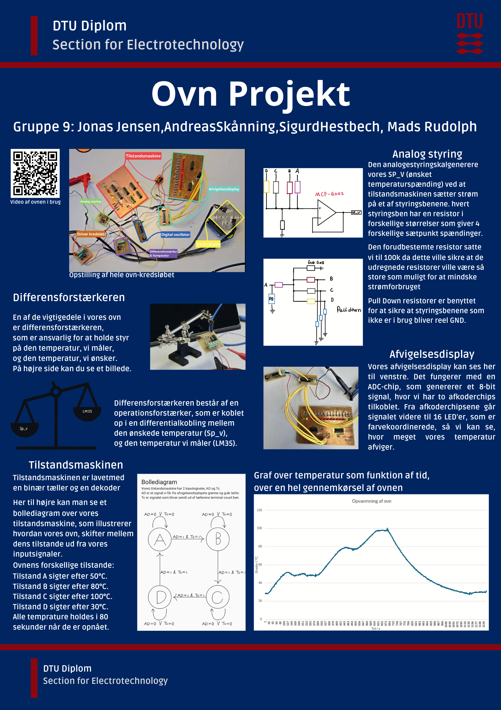

# 🔥 Ovn-Projekt — Pure Analog & Digital Oven Controller (No MCU)

A fully hardware-based oven control system designed and built with **analog + digital electronics** only — **no microcontroller** or pre-programmed ICs.  
All schematics and PCBs were created in **KiCad**. The final project uses a **hierarchical schematic** so all subsystems connect cleanly in one place.

> This was a tough one: we built the oven before learning every theory detail in class. That made it frustrating at times — and incredibly satisfying when everything finally worked.

---

## 🚀 Quick Start (Open the Project)

1. Open **KiCad 7/8** (tested with 8).
2. Open the **main project**:
   - `./OVN/OVN.kicad_pro`
3. Open the **top schematic**:
   - `./OVN/OVN.kicad_sch`  
   This is the top-level design with a **hierarchical sheet** that pulls in all subsystems (analog control, digital timing/state machine, deviation display, oscillator).
4. Optional: open the **PCB**:
   - `./OVN/OVN.kicad_pcb`

> The subfolders contain **intermediate/local variants** and backups. They’re useful for history, but the **final connected design** lives in `OVN/`.

---

## 🎯 Project Goals

- Automatically cycle between **three set temperatures** (e.g., 50 °C → 110 °C → 80 °C → repeat)
- Hold each temperature for a **fixed duration** (e.g., ~80 s)
- Maintain temperature within **±1 °C** of the target
- Provide **safety shutdown** above a critical threshold (e.g., 130 °C)
- Show **real-time temperature deviation** on an LED bar
- Implement everything with **discrete analog + digital logic** (no MCU/firmware)

---

## 🧩 System Overview

The oven control system is composed of **four main subsystems**:

### 1) Digital Oscillator
Generates clock signals for counters/timers and ADC timing.
- RC network + digital logic
- Adjustable frequency outputs
- Example board size around *35 mm × 47 mm*

### 2) Deviation Display (Afvigelsesdisplay)
Real-time visualization of error between current temperature and setpoint.
- **ADC0804** A/D converter
- **Two 74HC238** decoders → **16 LEDs**
- Center LEDs ≈ in-range (green), outer LEDs ≈ negative/positive deviation

### 3) Analog Control Circuit
Compares measured temperature to selected setpoint and drives the heater.
- Sensor: **LM35**
- **Op-amps** for differential amplification & comparators for thresholds
- **CD4066** analog switch selects between three setpoints
- Provides a scaled signal for the deviation display

### 4) Digital State Machine & Timing
Sequences the temperature program and dwell times.
- **74HC163** counters + combinational logic
- Generates `T1/T2/T3` signals for setpoint selection
- Drives indicators (LEDs / 7-segment) and coordinates timing

---
<h2>🧾 Project Poster</h2>

  
   
  <em>Click to open the full PDF</em>

---
## 🛠 Tools & Key Components

- **Design:** KiCad (schematic + PCB)
- **Test Gear:** Multimeter, oscilloscope, logic probes/analyzers
- **Key ICs/Parts:** LM35, ADC0804, 74HC238, 74HC163, CD4066, MCP6002, passives, LEDs

---

## ⚡ Workflow

1. **Subsystem Breadboarding** → validate analog thresholds, timing, and LED decoding  
2. **KiCad Schematic & PCB** → create/clean symbols and **custom footprints** as needed  
3. **Integration** → hierarchical sheet in `OVN` ties everything together  
4. **Debug & Iterate** → scope timing edges, adjust thresholds, verify stability and safety

---

## 🌟 Key Learnings

- Designing robust control with **only analog/digital logic** (no firmware safety net)
- Practical timing, noise, and threshold trade-offs in real hardware
- **KiCad** hierarchical design, footprint creation, and multi-board bring-up
- System-level debugging with mixed-signal interactions

---

## 👥 Team

- **Mads Vølkers Rudolph**  
- **Jonas Beck Jensen**
- **Sigurd Hestbech**
- **Andreas Skaaning**

---

## 🚀 Future Improvements

- MCU-based mode for flexible profiles + logging (keeping the analog chain as backup)
- PID/PI control for even tighter regulation
- Small display (OLED/LCD) with progress and temperature graphs

---

## 🏁 Result

The integrated **OVN** project reflects the **final working oven**:  
- Automatic multi-temperature cycling with dwell times  
- Safety cutoff behavior verified  
- Deviation display and timing logic functioning reliably

**No MCU. Just electrons doing the choreography.**
